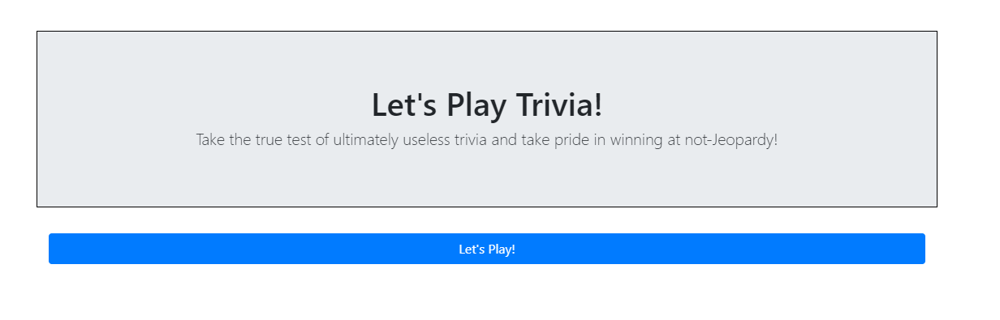
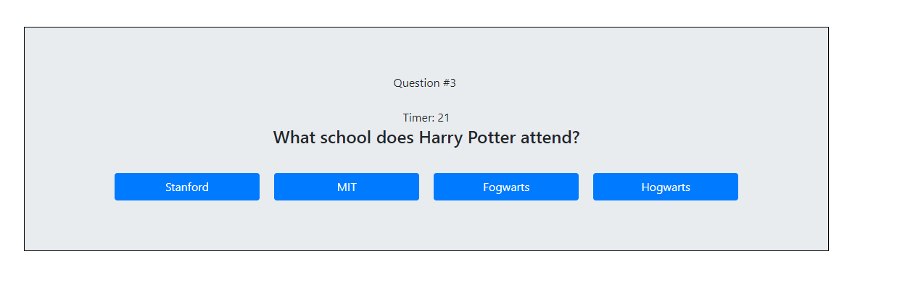

# Trivia-Game
This is a trivia game made with Javascript and the jQuery library as an assignment for the UC Berkeley Coding Bootcamp. In this assignment I specifically focused on dynamically generating and removing elements, as well as creating Javascript timer events to progress the game automatically.

The simple, responsive user interface is composed primarily with the Bootstrap CSS library and CSS keyframe animations sourced from Animista.

---
## How to Play

1. Click the 'Let's Play!' button to begin the game and the 30 second countdown timer.

1. Read the question and within 30 seconds, select the correct answer.

1. If you run out of time or select the wrong answer, you tally an incorrect answer.

1. If you select the correct answer, you tally a correct answer.

1. After the 10 questions, your score is tallied up and you can choose to play again.

---

## Technologies Used
* HTML
* Javascript, jQuery
* Git
* CSS
    * [@Bootstrap](https://getbootstrap.com/) CSS Library
    * [@animista](http://animista.net/) CSS Keyframe Animations

---

### Audio 

* SFX credits to:
    * [SoundBible.com](www.soundbible.com)